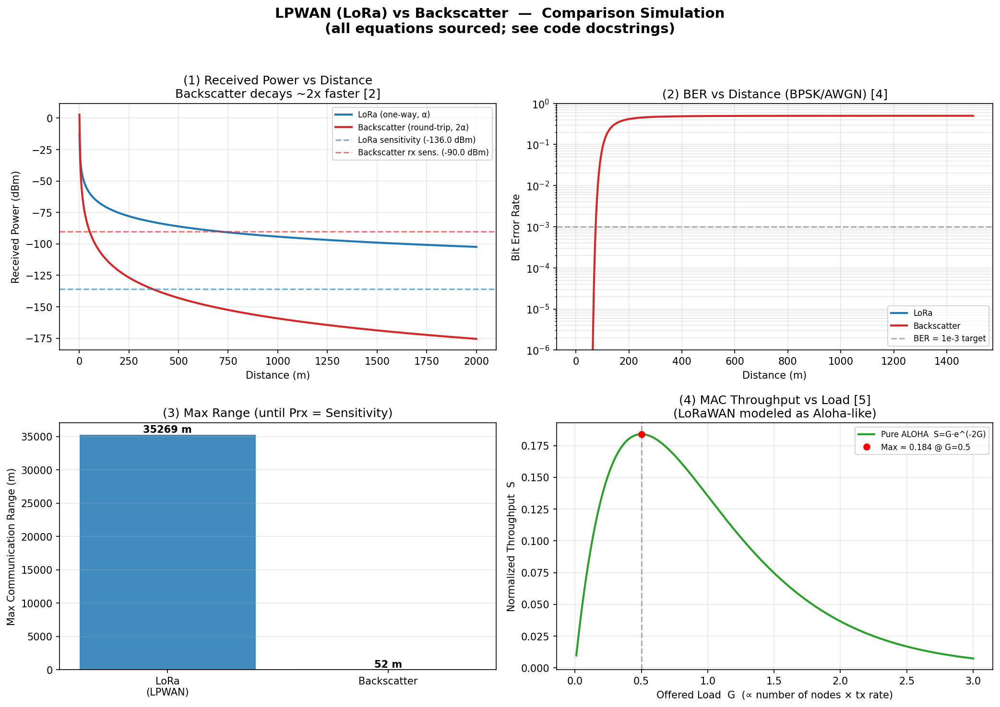

# Three Roads to Connect IoT
### LPWAN · Backscatter · Edge AI & TinyML — a comparative study of low-power, massive IoT, with a fully-sourced link-budget simulation

**Author - 김영환 (2021271316)**  

**Computer Networks · Group 4** — 김영환 (2021271316) · 김영도 (2024270612) · 최치우 (2025270614)

> 🎬 **Video presentation: [▶ Watch the video here](https://youtu.be/jF507OCnZ-k)**

[](https://youtu.be/jF507OCnZ-k)

---

**TL;DR** — As IoT scales toward billions of battery-constrained devices, the dominant energy cost is no longer on-device computation but the *act of communication itself*. We surveyed three complementary answers: **LPWAN** (transmit far on little power), **Backscatter** (barely transmit at all), and **Edge AI / TinyML** (transmit less in the first place). We then quantified the LPWAN-vs-Backscatter trade-off in a Python simulation in which **every equation was verified against its primary source** [1]–[7]. Under identical 868 MHz conditions, LoRa reaches **≈ 35.3 km** while backscatter reaches **≈ 52 m** — a **~678× gap** that follows *mathematically* from a single architectural difference: one-way vs. round-trip propagation. We show the closed-form derivation, the trade-offs each choice implies, and why the three technologies are complements rather than competitors.

---

## Table of Contents
1. [The Problem: Why "Low-Power" and "Massive" Matter](#1-the-problem-why-low-power-and-massive-matter)
2. [The Three Contenders](#2-the-three-contenders)
3. [The Decisive Difference: One-Way vs. Round-Trip](#3-the-decisive-difference-one-way-vs-round-trip)
4. [Simulation Design: Equations & Sources](#4-simulation-design-equations--sources)
5. [Results](#5-results)
6. [Logical Deduction: Why the Numbers *Must* Come Out This Way](#6-logical-deduction-why-the-numbers-must-come-out-this-way)
7. [Trade-off Analysis](#7-trade-off-analysis)
8. [Model Limitations (and Why the Conclusion Survives Them)](#8-model-limitations-and-why-the-conclusion-survives-them)
9. [Synthesis: Three Roads, One Destination](#9-synthesis-three-roads-one-destination)
10. [Reproducing the Results](#10-reproducing-the-results)
11. [Repository Structure](#11-repository-structure)
12. [References (IEEE Format)](#references-ieee-format)

---

## 1. The Problem: Why "Low-Power" and "Massive" Matter

The traditional IoT pipeline is simple: *sensor → send everything to the cloud → analyze on a server → return the result.* It works fine for a handful of devices. At massive scale, it collapses along four axes:

| Failure mode | Mechanism |
|---|---|
| **Battery drain** | Transmitting *all* raw data is the most expensive thing a sensor node does |
| **Network congestion** | Many uncoordinated devices transmitting at once → collisions |
| **Latency** | Every decision requires a round trip to the cloud |
| **Cost** | Scales with data volume and number of connections |

This leaves exactly **two directions for a solution**:

1. **Make transmission cheaper** — maximize the power- and range-efficiency of the link itself → *LPWAN* and *Backscatter*.
2. **Send less in the first place** — process on-device and transmit only what matters → *Edge AI / TinyML*.

Our team surveyed all three technologies, and for the two *communication* technologies we went further: we compared them head-to-head in code, under identical conditions, using only equations traceable to primary sources.

---

## 2. The Three Contenders

| Aspect | **LPWAN** | **Backscatter** | **Edge AI / TinyML** |
|---|---|---|---|
| Role | Long-range comms | Ultra-low-power comms | Low-power *processing* |
| Signal | Generates & amplifies (active) | Reflects ambient RF (passive) | Computation, not comms |
| Range | Several km | A few ~ tens of m | N/A |
| Power | 100s µW – 10s mW | A few µW (~1000× less) | Cuts compute & TX energy |
| Examples | LoRaWAN · Sigfox · NB-IoT | Ambient Backscatter, RFID | TensorFlow Lite Micro |

### 2.1 LPWAN — Far, on Little Power

A Low-Power Wide-Area Network node is an **active** radio: an internal oscillator and power amplifier generate the RF carrier directly. Because the signal travels only *one way* (node → gateway), path loss applies once, yielding kilometers of coverage; and because it needs nothing but its own base station, it is infrastructure-independent. LPWANs overwhelmingly use a **star / star-of-stars topology** — every node reaches a gateway in a single hop, which is fast, reliable, and above all battery-friendly compared to multi-hop mesh networks [8].

Three representative technologies illustrate the design space [8]: **LoRaWAN** (up to 10-year battery life, ~30 mi rural range, AES-128 security, adaptive data rate), **Sigfox** (3D ultra-narrow-band with time/frequency/space diversity, 0–12-byte payloads, ≈1.8 mJ per useful bit), and **NB-IoT** (LTE-based licensed band, PSM/eDRX sleep modes for 10-year battery, ≥1 M devices/km²).

The cost of being active: **peak transmit power is high**, and raising the data rate spikes active power consumption — which is why continuous streaming (audio/video) over LPWAN is structurally infeasible.

### 2.2 Backscatter — It *Reflects* Signals

Backscatter takes the opposite approach: instead of generating radio waves, the tag **reflects and modulates ambient RF** (Wi-Fi, TV, cellular) like a mirror. By switching the antenna's impedance to change its reflectivity — *load modulation* — it encodes the 0s and 1s [9]. With no power-hungry RF front-end, the tag's IC runs on a few microwatts: roughly **1000× better energy-per-bit** than conventional radios, enabling 5+ years on a coin cell or fully battery-free operation via energy harvesting [9], [10].

The decisive limitation is geometric. The signal travels *source → tag → reader* — a round-trip, **dyadic** path. Loss is incurred on **both** segments, so received power falls off as **r⁴** instead of r² [2], the reflected signal is extremely weak, the channel suffers composite (triple-Rayleigh) fading [11], and the system is dead without an external carrier source. Practical ranges are meters to tens of meters. Key enabling techniques include reflection-coefficient symbol modulation (BPSK/QPSK), non-coherent detection from received-energy statistics, and self-interference cancellation [10], [11]. Looking ahead, ambient backscatter is also being explored as a building block of 6G systems in combination with AI and non-terrestrial networks [12].

### 2.3 Edge AI / TinyML — Send Less in the First Place

The third road is **not a transport at all**. Edge AI processes sensor data *on the device* and transmits only meaningful results — e.g., not the temperature every second, but an alert when a threshold is crossed [13]. The benefits are energy efficiency, low latency, lower network load, and privacy (raw data never leaves the device). The cost: microcontrollers are tiny, so models must be compressed via quantization/pruning, trading some accuracy [14]. Edge AI rides *on top of* protocols such as MQTT, CoAP, LoRaWAN, and NB-IoT — it complements them rather than replacing them [13].

This is not theoretical. **Tesla** processes camera/sensor data inside the vehicle for lane and pedestrian detection, because communication latency is unacceptable in driving. **Google** ships TensorFlow Lite for Microcontrollers, bringing ML to µW-class MCUs [15]. **Samsung** runs local voice and security analytics in SmartThings, transmitting only on significant events.

---

## 3. The Decisive Difference: One-Way vs. Round-Trip

Everything in our simulation flows from one structural fact:

```
LPWAN:        node ────────────────▶ gateway          (one-way   → path-loss exponent × 1)
Backscatter:  source ──▶ tag ──▶ reader               (round-trip → path-loss exponent × 2, r⁴ decay)
```

Griffin & Durgin's link-budget analysis of backscatter systems shows the monostatic received power carries a **(4πr)⁴ denominator** — "scattered power falls off as r⁴" [2]. In log-distance form, this means the effective path-loss exponent **doubles**. Section 6 shows that this single doubling is *sufficient* to predict the entire range gap we measured.

---

## 4. Simulation Design: Equations & Sources

We compared the two technologies under **identical conditions** in the 868 MHz ISM band, computing four metrics. Every equation and parameter was checked **directly against its primary source** (original paper, manufacturer datasheet, or standard) — not against secondary blogs or slides.

### 4.1 Models used

| # | Metric | Model | Equation | Primary source |
|---|---|---|---|---|
| 1 | Received power | Log-distance path loss | `PL(d) = PL(d₀) + 10·n·log₁₀(d/d₀)` | Rappaport, Eq. (3.93) [1] |
| 2 | Backscatter link | Dyadic round-trip | exponent ×2 → r⁴ decay | Griffin & Durgin, Eq. (2) [2] |
| 3 | Reference loss at d₀ | Free-space (Friis) | `PL(1 m) = 20·log₁₀(f) − 147.55` | ITU-R P.525-3, Eq. (3) [7] |
| 4 | Bit error rate | Coherent BPSK / AWGN | `P_b = Q(√(2E_b/N₀)) = 0.5·erfc(√SNR)` | Proakis & Salehi, Eq. (4.3-13) [4] |
| 5 | Multi-node throughput | Pure ALOHA | `S = G·e^(−2G)` (max 1/2e ≈ 0.184) | Abramson, Eq. (2) [5] |
| 6 | Noise floor | Thermal noise | `N = −174 dBm/Hz + 10·log₁₀(BW) + NF` | Röhrig et al. [6] / ITU-R |

### 4.2 Key parameters

| Parameter | Value | Source / note |
|---|---|---|
| Frequency | 868 MHz (sub-GHz ISM) | [6] |
| Path-loss exponent *n* | 2.7 | **assumed value**, chosen from Rappaport's measured per-environment range [1] (see note below) |
| LoRa TX power | 14 dBm | EU regulatory limit [6] |
| LoRa sensitivity | **−136 dBm** (SF12, BW = 125 kHz) | Semtech SX1276 datasheet, Table RFS_L125_HF [3] — deliberately *not* the headline −148 dBm figure |
| Receiver noise figure | 6 dB | [3] |
| Backscatter carrier power | 30 dBm (~1 W) | assumed, within [2]'s ranges |
| Backscatter integrated loss | 10 dB | modulation factor M · polarization X · fade margin F₂, consolidated [2] |
| Backscatter reader sensitivity | −90 dBm | conservative commodity-reader assumption |
| Antenna gains | LoRa 2/2 dBi · tag 1 dBi · reader 6 dBi | assumed values |

**Source-verification notes**: the r⁴ behaviour was confirmed against Griffin & Durgin's Eq. (2) denominator [2]; the LoRa sensitivity was taken from the exact SF12/125 kHz table entry rather than the datasheet's best-case maximum [3]; Abramson's original notation *rτ = Rτ·e^(−2Rτ)* was confirmed to be identical to the textbook form *S = G·e^(−2G)* up to variable renaming [5]; and the BER expression was derived from Proakis's Q-function form via the identity Q(x) = ½·erfc(x/√2) [4].

> **A note on the path-loss exponent.** Rappaport [1] provides *measured* path-loss exponents grouped by environment (free space ≈ 2; urban/in-building ≈ 3–5; etc.) — it supplies a **range**, not a single prescribed number. Our value **n = 2.7** is therefore an **assumed value** that we selected from within that range as representative of a suburban / semi-urban setting; it is not a figure quoted verbatim from the source. The log-distance *equation* (Eq. 3.93) is taken directly from [1]; the *choice* of 2.7 is ours.

---

## 5. Results



**How to read the four panels:**

**(1) Received power vs. distance** — Both curves start near the same point, but the red backscatter curve falls at **54 dB/decade** (2 × 10 × 2.7) versus LoRa's **27 dB/decade**. The dashed lines are the respective sensitivities; the crossings define maximum range.

**(2) BER vs. distance** — Backscatter's bit-error rate climbs past the 10⁻³ target within roughly a hundred meters, while LoRa's BER remains below 10⁻⁶ across the entire 1.5 km axis (the blue curve hugs the floor of the plot, which is why it is barely visible). Same cause: SNR falls twice as fast per decade of distance for backscatter, and the erfc(·) function turns that into an abrupt cliff.

**(3) Maximum range** — The headline result:

| Metric | LoRa (LPWAN) | Backscatter | Ratio |
|---|---:|---:|---:|
| Max range (Prx ≥ sensitivity) | **35,269 m** | **52 m** | **≈ 678×** |

**(4) MAC throughput vs. load** — Modeling LoRaWAN-class uncoordinated access as Pure ALOHA, normalized throughput peaks at **S ≈ 0.184 at G = 0.5** [5] and *decays* beyond it. This ceiling is PHY-agnostic: it binds LPWAN and backscatter alike, and is the "massive" half of the problem.

---

## 6. Logical Deduction: Why the Numbers *Must* Come Out This Way

The simulation finds the range numerically, but they can be **derived in closed form** — which both sanity-checks the code and exposes the underlying law.

Setting received power equal to sensitivity and solving the link budget for distance (d₀ = 1 m):

$$
d_{\max} = 10^{\frac{P_{tx} + G_{\Sigma} - PL(1\,\mathrm{m}) - L - P_{sens}}{10\,n_{\mathrm{eff}}}}
\qquad
n_{\mathrm{eff}} = \begin{cases} n & \text{one-way (LPWAN)} \\ 2n & \text{round-trip (backscatter)} \end{cases}
$$

With PL(1 m) = 20·log₁₀(868 MHz) − 147.55 ≈ **31.2 dB** [7]:

* **LoRa:** budget = 14 + 4 − 31.2 + 136 = **122.8 dB**, exponent 10n = 27 →
  d_max = 10^(122.8/27) ≈ **35.3 km** ✓ (simulation: 35,269 m)
* **Backscatter:** budget = 30 + 14 − 10 − 31.2 + 90 = **92.8 dB**, exponent 10·(2n) = 54 →
  d_max = 10^(92.8/54) ≈ **52 m** ✓ (simulation: 52 m)

The closed form matches the numerical search exactly — and it yields the punchline deduction:

> **Doubling the path-loss exponent square-roots the range.** Since 10^(B/2k) = √(10^(B/k)), the *same* backscatter link budget that would carry a **one-way** signal **≈ 2.7 km** (10^(92.8/27) ≈ 2731 m) carries a **round-trip** backscatter signal only **√2731 ≈ 52 m** (with d₀ = 1 m). The ~678× gap (35,269 / 52 on the integer search grid; ≈ 675× from the continuous closed form) is not a parameter accident — it is the *square-root law of dyadic propagation*. No amount of tuning the assumed values changes its character, only its magnitude.

Two further deductions follow from the same chain of reasoning:

1. **The BER cliff location is range in disguise.** BER depends only on SNR, and SNR inherits the 27 vs. 54 dB/decade slopes. Hence backscatter doesn't just stop *reaching* — it stops being *correct* at proportionally shorter distances (panel 2 is panel 1 passed through erfc).
2. **The MAC ceiling is orthogonal to the PHY — and that is exactly where Edge AI enters.** Pure ALOHA caps useful throughput at 18.4 % *regardless* of whether the radio is LoRa or backscatter [5]. The only lever that moves a congested network (G > 0.5) back toward the optimum is **reducing offered load G** — which is precisely what on-device filtering does. Edge AI doesn't compete with the radios; it *relocates their operating point* on the ALOHA curve while simultaneously saving transmit energy.

---

## 7. Trade-off Analysis

| Dimension | LPWAN | Backscatter |
|---|---|---|
| Signal generation | Active (oscillator + PA) | Passive (reflection) |
| Power use | 100s µW – 10s mW | a few µW (~1000× less) |
| Path loss | ×1 (one-way) | ×2 (round-trip, r⁴) |
| Range | several km (35.3 km simulated) | tens of m (52 m simulated) |
| Battery life | days–months on a coin cell | 5+ years / battery-free |
| External dependency | none (own base station) | requires ambient carrier |
| High data-rate streaming | structurally infeasible | favorable (power barely rises with rate) |
| Fading environment | standard | composite triple-Rayleigh [11] |

The decision rule that falls out:

* Need **range and infrastructure independence** (wide-area sensing, periodic small payloads) → **LPWAN**.
* Need **extreme low power / battery-free operation** at short range (implants, embedded tags, cold-chain) → **Backscatter**.
* In **either** case, facing the 18.4 % ALOHA ceiling at scale → add **Edge AI / TinyML** to shrink G.

There is no free lunch: choosing range buys you peak-power and battery constraints; choosing micro-power buys you the square-root law and carrier dependency. The simulation makes the price of each choice numerically explicit.

---

## 8. Model Limitations (and Why the Conclusion Survives Them)

We state our simplifications openly — each was a deliberate trade of realism for clarity, and none threatens the qualitative conclusion:

1. **Shadowing omitted.** Rappaport's model includes a log-normal term X_σ [1]; we used only the deterministic part. Effect: our ranges are *means*, not guarantees.
2. **Backscatter losses consolidated.** Modulation factor M, polarization mismatch X, and fade margin F₂ from [2] were merged into a single 10 dB loss. Real systems vary; the r⁴ structure does not.
3. **BPSK/AWGN instead of LoRa's CSS.** Actual LoRa uses chirp spread spectrum with coding gain; our BER panel is a like-for-like modulation comparison, not a LoRa-PHY emulation. The *sensitivity* figure (−136 dBm), which drives the range result, is the real datasheet value [3].
4. **Pure ALOHA as a LoRaWAN approximation** — standard in the literature, but it ignores duty-cycle regulation and capture effects [5].
5. **Assumed values** (backscatter carrier power, antenna gains, reader sensitivity) were chosen conservatively within ranges reported in [2].

Crucially, the headline finding — the **square-root law** of Section 6 — depends only on the exponent doubling, which is the best-established fact in the whole model [2]. Shifting every assumed parameter moves the 52 m figure, but cannot make a dyadic link behave like a one-way link.

---

## 9. Synthesis: Three Roads, One Destination

The three technologies are **not competitors** — each attacks a different term of the same cost function:

```
 Edge AI / TinyML          LPWAN  or  Backscatter
 ────────────────          ────────────────────────
 decides WHAT to send  →   carries it EFFICIENTLY
 (shrinks G, saves TX)     (long-range  |  µW-class)
```

The ideal low-power massive-IoT stack is therefore a *pipeline*: **Edge AI cuts the data → LPWAN or Backscatter (chosen by the range/power trade-off of Section 7) transmits the remainder.** Our survey covered all three roads; our simulation priced the fork between the first two; and the ALOHA analysis showed why the third road makes both of the others scale.

---

## 10. Reproducing the Results

```bash
# Requirements: Python 3.9+
pip install numpy scipy matplotlib

# Run the simulation (regenerates the four-panel figure)
python lpwan_vs_backscatter.py
```

Expected console summary:

| Quantity | Value |
|---|---:|
| LoRa noise power (BW 125 kHz) | −117.0 dBm |
| Backscatter noise power (BW 2 MHz) | −105.0 dBm |
| LoRa max range | 35,269 m |
| Backscatter max range | 52 m |
| Range ratio | ≈ 678× |

Every function in [`lpwan_vs_backscatter.py`](lpwan_vs_backscatter.py) carries a docstring citing the primary source `[N]` of its equation, so the code is auditable line-by-line against the reference list below.

---

## 11. Repository Structure

```
.
├── README.md                            ← this tech blog (problem · solutions · trade-offs · results)
├── lpwan_vs_backscatter.py              ← fully-sourced comparison simulation
├── lpwan_vs_backscatter_results.png     ← four-panel figure generated by the code (embedded above)
└── CN_Group4_Slides.pdf                 ← presentation deck (18 slides)
```

---

## References (IEEE Format)

*Sources [1]–[7] underpin the simulation and were verified directly against the primary documents; [8]–[15] are the sources surveyed for the technology sections.*

[1] T. S. Rappaport, *Wireless Communications: Principles and Practice*, 2nd ed. Upper Saddle River, NJ, USA: Prentice Hall, 2002, Sec. 3.11.3, Eq. (3.93).

[2] J. D. Griffin and G. D. Durgin, "Complete link budgets for backscatter-radio and RFID systems," *IEEE Antennas Propag. Mag.*, vol. 51, no. 2, pp. 11–25, Apr. 2009, Sec. 3.2, Eq. (2).

[3] Semtech Corporation, "SX1276/77/78/79 — 137 MHz to 1020 MHz Low Power Long Range Transceiver," SX1276/77/78/79 Datasheet, Rev. 7, Camarillo, CA, USA, May 2020, Table "RFS_L125_HF".

[4] J. G. Proakis and M. Salehi, *Digital Communications*, 5th ed. New York, NY, USA: McGraw-Hill, 2008, Eq. (4.3-13).

[5] N. Abramson, "The ALOHA system: Another alternative for computer communications," in *Proc. AFIPS Fall Joint Comput. Conf.*, vol. 37, 1970, pp. 281–285, Eq. (2).

[6] C. Röhrig, D. Heß, and B. H. D. Trinh, "System design for distributed energy management using multiple LPWAN technologies," in *Proc. IECON 2025 — 51st Annu. Conf. IEEE Ind. Electron. Soc.*, 2025.

[7] Recommendation ITU-R P.525-3, "Calculation of free-space attenuation," ITU-R, Geneva, Switzerland, Sep. 2016, Annex 1, Eq. (3).

[8] B. S. Chaudhari and M. Zennaro, Eds., *LPWAN Technologies for IoT and M2M Applications*. Cambridge, MA, USA: Academic Press, 2020.

[9] V. Liu, A. Parks, V. Talla, S. Gollakota, D. Wetherall, and J. R. Smith, "Ambient backscatter: Wireless communication out of thin air," in *Proc. ACM SIGCOMM*, 2013, pp. 39–50.

[10] V. Talla, M. Hessar, B. Kellogg, A. Najafi, J. R. Smith, and S. Gollakota, "LoRa backscatter: Enabling the vision of ubiquitous connectivity," *Proc. ACM Interact. Mobile Wearable Ubiquitous Technol. (IMWUT)*, vol. 1, no. 3, pp. 1–24, Sep. 2017.

[11] D. Darsena, G. Gelli, and F. Verde, "Modeling and performance analysis of wireless networks with ambient backscatter devices," *IEEE Trans. Commun.*, vol. 65, no. 4, pp. 1797–1814, Apr. 2017.

[12] M. A. Jamshed, B. Haq, M. A. Mohsin, A. Nauman, and H. Yanikomeroglu, "Artificial intelligence, ambient backscatter communication and non-terrestrial networks: A 6G commixture," arXiv, 2023.

[13] P. Warden and D. Situnayake, *TinyML: Machine Learning with TensorFlow Lite on Microcontrollers*. Sebastopol, CA, USA: O'Reilly Media, 2019.

[14] C. Banbury *et al.*, "Benchmarking TinyML systems: Challenges and directions," arXiv:2003.04821, 2021.

[15] Google, "LiteRT for Microcontrollers (TensorFlow Lite for Microcontrollers)," 2024. [Online]. Available: https://ai.google.dev/edge/litert/microcontrollers/overview

---

AI assistance: An AI assistant was used to help with drafting and proofreading the text of this document, and provided coding assistance.  All technical content, equations, simulations, and sources were determined and verified by group members.
